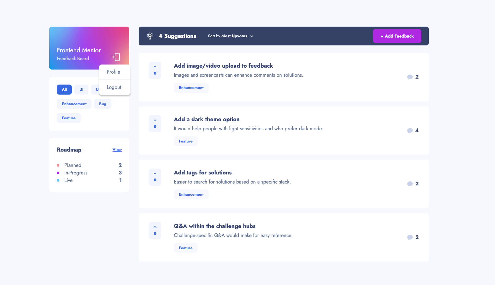

# Product Feedback App

## Table of Contents

- [Overview](#overview)
- [The Challenge](#the-challenge)
- [Screenshot](#screenshot)
- [Links](#links)
- [My Process](#my-process)
  - [Built With](#built-with)
- [What I Learned](#what-i-learned)
- [Continued Development](#continued-development)
- [Useful Resources](#useful-resources)
- [Installation](#installation)
- [Usage](#usage)
- [Project Structure](#project-structure)

## Overview

### The Challenge

This project is a product feedback platform inspired by a Frontend Mentor challenge. The goal was to build a web application that allows users to:

- View the optimal layout for the app depending on their device's screen size
- See hover states for all interactive elements on the page
- Create, read, update, and delete feedbacks with category and status filtering.
- Add comments and replies to a product feedback request
- Upvote product feedback requests
- Use static site generation (SSG) with incremental static regeneration (ISR) for performance.
- Integrate a serverless database for persistent storage and validate forms on both client and server sides.
- Provide a smooth user experience with toast notifications and loading indicators.
- Sign up and log in securely to manage feedback.

## Screenshot



## Links

- **Live Site URL**: [Project-feedback-app](https://project-feedback-app-six.vercel.app)

## My Process

### Built With

- **Next.js**: React framework for server-side rendering, SSG, and server actions.
- **React**: Building UI components with hooks.
- **TypeScript**: Static typing for improved code reliability.
- **NextAuth.js**: Authentication with credentials provider.
- **Drizzle ORM**: Type-safe database queries with Neon serverless database.
- **Formik**: Form handling.
- **Zod**: Schema validation for forms and server actions.
- **Tailwind CSS**: Utility-first CSS for responsive styling.
- **React Toastify**: Notification system for user feedback.
- **React Modal**: Modal for feedback deletion confirmation.
- **React Spinners**: Loading indicators for async operations.
- **Vitest**: Testing framework with React Testing Library.

## What I Learned

- **React (with Hooks)**: Built modern React applications using hooks for state management and side effects, such as `useState`, `useTransition`, and custom hooks like `useFilter`.
- **Next.js**: Leveraged server-side rendering, SSG, ISR, and server actions to create a dynamic, performant application with `revalidateTag` for cache updates.
- **TypeScript**: Implemented type-safe components, server actions, and database queries to ensure robust code.
- **Authentication and Authorization**: Managed user sessions and permissions with NextAuth.js, including secure JWT-based authentication.
- **Form Management**: Handled complex form logic and validation using Formik and Zod, with client-side and server-side checks.
- **Database Integration**: Performed CRUD operations with Drizzle ORM and Neon database.
- **Responsive Design**: Created mobile-first layouts with Tailwind CSS.
- **Accessibility**: Added ARIA attributes and semantic HTML to support screen readers and keyboard navigation.
- **Testing**: Wrote tests with Vitest and React Testing Library.
- **Deployment**: Deployed application to Vercel.
- **Error Handling**: Managed errors using server actions, and toast notifications for a seamless user experience.
- **Performance Optimization**: Used SSG, ISR, and `revalidateTag` to ensure efficient data updates and fast page loads.

## Continued Development

- **Testing**: Expand test coverage for edge cases and add end-to-end tests with Playwright or Cypress.

## Useful Resources

- [Next.js Documentation](https://nextjs.org/docs) - Comprehensive guide for SSG, ISR, and server actions.
- [Tailwind CSS Documentation](https://tailwindcss.com/docs) - Helped with responsive, utility-first styling.
- [Drizzle ORM Documentation](https://orm.drizzle.team/docs) - Useful for type-safe database queries.
- [NextAuth.js Documentation](https://authjs.dev/getting-started/installation) - Guided authentication setup.
- [React Testing Library](https://testing-library.com/docs/react-testing-library/intro/) - Best practices for testing React components.

## Installation

#### Clone the repository:

```
git clone https://github.com/akivonen/chat-app.git
```

#### Install dependencies:

```
make install
```

#### Set up environment variables:

Create .env and .env.local files in the project root.
Add NEXTAUTH_URL, DATABASE_URL for Neon to .env:

```
NEXTAUTH_URL=http://localhost:3000
DATABASE_URL=your-neon-database-url
```

Add your AUTH_SECRET for NextAuth to .env.local:

```
AUTH_SECRET=your-auth-secret
```

#### Run database migrations:

```
npx drizzle-kit push
```

### Usage

#### Development: Run make dev to start the development server with Turbopack.

```
make dev
```

#### Build: Run make build to create a production build.

```
make build
```

#### Production: Run make start to start the production server.

```
make start
```

#### Testing: Run make test to execute tests.

```
make test
```

#### Linting: Run make lint to check code quality with ESLint.

```
make lint
```

## Project Structure

- src/app: Next.js app router with pages, layouts, and server actions.
- src/components: Reusable UI components.
- src/db: Database queries and schema using Drizzle ORM.
- src/providers: Context providers for session and feedback state.
- src/types: TypeScript type definitions.
- public: Static assets (e.g., images, favicon).
